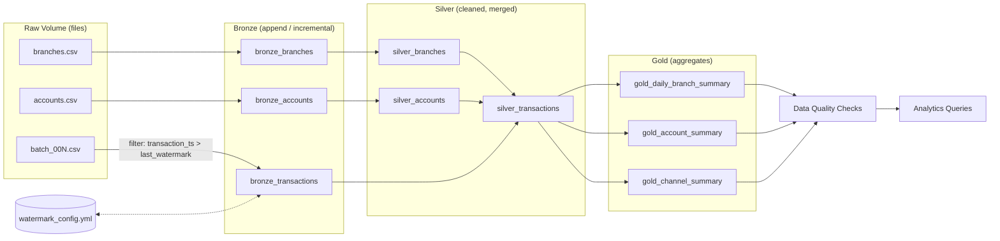

# Data Lineage & Pipeline Structure

## Task -> file -> layer map

| Job task              | File attached                                  | Reads                                        | Writes                                                                 |
|------------------------|-------------------------------------------------|-----------------------------------------------|--------------------------------------------------------------------------|
| setup_infra            | notebooks/00_setup_catalog_schema_volumes.py    | -                                             | catalog, 4 schemas, `raw.landing_zone` volume                            |
| generate_synthetic_data| data_generator/generate_synthetic_data.py       | -                                             | Volume CSVs: `dimensions/branches.csv`, `dimensions/accounts.csv`, `transactions/batch_00N.csv` |
| bronze_ingest           | notebooks/01_bronze_ingest_incremental.py       | Volume CSVs + `_checkpoints/watermark_config.yml` | `bronze.bronze_branches`, `bronze.bronze_accounts`, `bronze.bronze_transactions` (append, incremental) |
| silver_transform        | notebooks/02_silver_transform.py                | bronze tables                                 | `silver.silver_branches`, `silver.silver_accounts`, `silver.silver_transactions` (merge/upsert) |
| gold_aggregate          | notebooks/03_gold_aggregate.py                  | `silver.silver_transactions`                  | `gold.gold_daily_branch_summary`, `gold.gold_account_summary`, `gold.gold_channel_summary` |
| data_quality_checks     | notebooks/04_data_quality_checks.py             | silver + gold tables                          | prints PASS/FAIL report, fails the job run on critical failure           |
| analytics_queries       | notebooks/05_analytics_queries.py               | gold tables                                   | 5 displayed query results (no write)                                     |

## Pipeline flow

## Column-level lineage (transactions, the incremental fact table)

| Gold column        | Comes from (silver)          | Comes from (bronze)             | Comes from (raw file)          |
|---------------------|-------------------------------|------------------------------------|-----------------------------------|
| txn_count / total_amount | `silver_transactions.amount` | `bronze_transactions.amount`       | `batch_00N.csv: amount`          |
| branch_name          | `silver_branches.branch_name` (joined) | `bronze_branches.branch_name`  | `branches.csv: branch_name`      |
| account_type         | `silver_accounts.account_type` (joined) | `bronze_accounts.account_type` | `accounts.csv: account_type`     |
| net_movement         | derived: `transaction_type` + `amount` | same                             | `batch_00N.csv: transaction_type, amount` |

## Why this counts as "incremental"

Every notebook run of `generate_synthetic_data.py` drops **one new CSV file** into
`transactions/`, mimicking a new day's dump landing in the lake. The bronze
notebook does **not** reprocess the whole folder blindly — it reads the
current `last_watermark` from the yml checkpoint, keeps only rows with
`transaction_ts > last_watermark`, appends just those to bronze, then writes
the new max watermark back to the yml. Silver then merges (upserts) on
`transaction_id`, so re-running the job never creates duplicates even if a
batch file is reprocessed.
